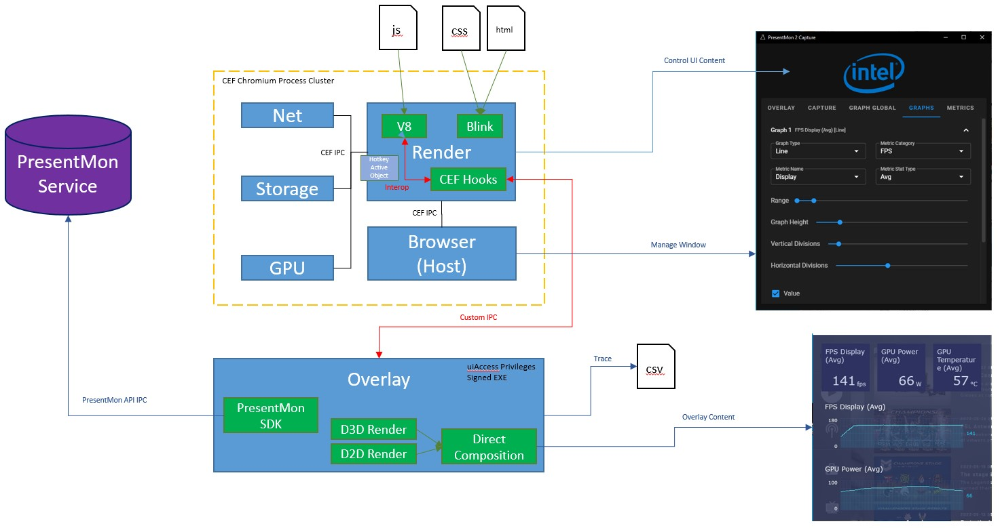

# PresentMon Capture Application

The **PresentMon Capture Application** is both an trace capture and realtime performance overlay for games and other graphics-intensive applications. It uses the [PresentMon Service](README-Service.md) to collect performance data, a custom Direct3D 11 renderer to display a realtime performance overlay, and a CEF-based UI to configure overlay and trace capture functionality.



## Usage

To run the *PresentMon Capture Application*, run `PresentMon.exe`.

Only severe errors are logged by default in Release configuration. To log all errors in release:

```text
--p2c-verbose
```

Logs and cache files are written to `%AppData%\PresentMon2Capture` by default. You can change this to the working directory of the application (convenient when launching Debug build from IDE):

```text
--p2c-files-working
```

Enable experimental support for tearing presents (required for Variable Refresh Rate):

```text
--p2c-allow-tearing
```

In Debug configuration, the application will halt with a modal error dialog whenever a resource is requested from a non-local (network) URL. This flag disables that behavior:

```text
--p2c-no-net-fail
```

## Metric and CSV Column Definitions

| Metric | CSV Column | Description | Compatible Query Types |
| - | - | - |:-:|
|Application|Application|Name of the executable of the process being targeted|DS|
||ProcessID|ID of the process being targeted||
|Swap Chain Address|SwapChainAddress|Address of the swap chain used to present, useful as a unique identifier|F|
|GPU Vendor||Vendor name of the GPU|DS|
|GPU Name||Device name of the GPU|DS|
|CPU Vendor||Vendor name of the CPU|DS|
|CPU Name||Device name of the CPU|DS|
|CPU Start Time|CPUStartTime|Time elapsed since the start of ETW event tracing|F|
|Frame Time|FrameTime|The total amount of time in between frames on the CPU|DF|
|CPU Busy|CPUBusy|How long the CPU was generating the frame in milliseconds|DF|
|CPU Wait|CPUWait|How long the CPU spent waiting before it could start generating the frame in milliseconds|DF|
|Displayed FPS||Rate of frame change measurable at display|D|
|Presented FPS||Rate of application calls to a Present() function|D|
|GPU Time|GPUTime|Total amount of time between when GPU started frame and when it finished in milliseconds. The GPU may not have been fully busy during this time|DF|
|GPU Busy|GPUBusy|How long the GPU spent working on this frame|DF|
|GPU Wait|GPUWait|How long the GPU spent waiting while working on this frame|DF|
|Dropped Frames||Indicates if the frame was not displayed|DF|
|Displayed Time|DisplayedTime|How long this frame was displayed on screen|DF|
|Animation Error|MsAnimationError|The difference between the previous frame's CPU delta and display delta|DF|
|Animation Time|AnimationTime|The difference between the previous frame's CPU delta and display delta|F|
|Sync Interval|SyncInterval|The application's requested interval between presents measured in vertical sync/vblank events|DF|
|Present Flags|PresentFlags|Flags used to configure the present operation|DF|
|Present Mode|PresentMode|Method used to present the frame|DF|
|Present Runtime|PresentRuntime|The graphics runtime used for the present operation (DXGI, D3D9, etc.)|DF|
|Allows Tearing|AllowsTearing|Indicates if the frame allows tearing|DF|
|Frame Type|FrameType|Whether the frame was rendered by the application or interpolated by a driver/SDK.|DF|
|GPU Latency|GPULatency|How long it took until GPU work for this frame started|DF|
|Display Latency|DisplayLatency|Time between frame submission and scan out to display|DF|
|Click To Photon Latency|MsClickToPhotonLatency|Time between mouse click input and display|DF|
|GPU Sustained Power Limit||Sustained power limit of the GPU|DS|
|GPU Power|GPUPower|Power consumed by the graphics adapter|DF|
|GPU Voltage|GPUVoltage|Voltage consumed by the graphics adapter|DF|
|GPU Frequency|GPUFrequency|Clock speed of the GPU cores|DF|
|GPU Temperature|GPUTemperature|Temperature of the GPU|DF|
|GPU Fan Speed|GPUFanSpeed|Rate at which a GPU cooler fan is rotating|DF|
|GPU Utilization|GPUUtilization|Amount of GPU processing capacity being used|DF|
|3D/Compute Utilization|3D/ComputeUtilization|Amount of 3D/Compute processing capacity being used|DF|
|Media Utilization|MediaUtilization|Amount of media processing capacity being used|DF|
|GPU Power Limited|GPUPowerLimited|GPU frequency is being limited because GPU is exceeding maximum power limits|DF|
|GPU Temperature Limited|GPUTemperatureLimited|GPU frequency is being limited because GPU is exceeding maximum temperature limits|DF|
|GPU Current Limited|GPUCurrentLimited|GPU frequency is being limited because GPU is exceeding maximum current limits|DF|
|GPU Voltage Limited|GPUVoltageLimited|GPU frequency is being limited because GPU is exceeding maximum voltage limits|DF|
|GPU Utilization Limited|GPUUtilizationLimited|GPU frequency is being limited due to low GPU utilization|DF|
|GPU Memory Power|GPUMemoryPower|Power consumed by the GPU memory|DF|
|GPU Memory Voltage|GPUMemoryVoltage|Voltage consumed by the GPU memory|DF|
|GPU Memory Frequency|GPUMemoryFrequency|Clock speed of the GPU memory|DF|
|GPU Memory Effective Frequency|GPUMemoryEffectiveFrequency|Effective data transfer rate GPU memory can sustain|DF|
|GPU Memory Temperature|GPUMemoryTemperature|Temperature of the GPU memory|DF|
|GPU Memory Size|GPUMemorySize|Size of the GPU memory|DS|
|GPU Memory Size Used|GPUMemorySizeUsed|Amount of used GPU memory|DF|
|GPU Memory Utilization||Percent of GPU memory used|D|
|GPU Memory Max Bandwidth|GPUMemoryMaxBandwidth|Maximum total GPU memory bandwidth|DS|
|GPU Memory Write Bandwidth|GPUMemoryWriteBandwidth|Maximum GPU memory bandwidth for writing|DF|
|GPU Memory Read Bandwidth|GPUMemoryReadBandwidth|Maximum GPU memory bandwidth for reading|DF|
|GPU Memory Power Limited|GPUMemoryPowerLimited|Memory frequency is being limited because the memory modules are exceeding the maximum power limits|DF|
|GPU Memory Temperature Limited|GPUMemoryTemperatureLimited|Memory frequency is being limited because the memory modules are exceeding the maximum temperature limits|DF|
|GPU Memory Current Limited|GPUMemoryCurrentLimited|Memory frequency is being limited because the memory modules are exceeding the maximum current limits|DF|
|GPU Memory Voltage Limited|GPUMemoryVoltageLimited|Memory frequency is being limited because the memory modules are exceeding the maximum voltage limits|DF|
|GPU Memory Utilization Limited|GPUMemoryUtilizationLimited|Memory frequency is being limited due to low memory traffic|DF|
|CPU Utilization|CPUUtilization|Amount of CPU processing capacity being used|DF|
|CPU Power Limit||Power limit of the CPU|DS|
|CPU Power|CPUPower|Power consumed by the CPU|DF|
|CPU Temperature|CPUTemperature|Temperature of the CPU|DF|
|CPU Frequency|CPUFrequency|Clock speed of the CPU|DF|
|CPU Core Utility||Amount of CPU processing utility being used per core|D|
|All Input To Photon Latency|MsAllInputToPhotonLatency|Time between any input and display|DF|
|Instrumented Latency|InstrumentedLatency|How long it took from the instrumented start of this frame until the frame was displayed on the screen|DF|
|GPU Effective Frequency||Effective clock speed of the GPU cores|DF|
|GPU Voltage Regulator Temperature||Voltage regulator temperature|DF|
|GPU Memory Effective Bandwidth||Data transfer rate that the memory modules can sustain based on current clock frequency|DF|
|GPU Overvoltage Percent||GPU overvoltage increment as a ratio of the maximum increment|DF|
|GPU Temperature Percent||GPU temperature as a ratio of the thermal margin|DF|
|GPU Power Percent||GPU power draw as a ratio of default maximum power|DF|
|GPU Fan Speed Percent||GPU fan speed as a ratio of the max speed for that fan|DF|
|GPU Card Power||,Total power consumption of the graphics adapter board|DF|
|Present Start Time|TimeInSeconds|The time the Present() call was made, in seconds|F|
|Present Start QPC|Present Start QPC|The time the Present() call was made as a QueryPerformanceCounter() value|F|
|Between Presents|MsBetweenPresents|The time between this Present() call and the previous one, in milliseconds|F|
|In Present API|MsInPresentAPI|The time spent inside the Present() call, in milliseconds.|F|
|Between Display Change|MsBetweenDisplayChange|How long the previous frame was displayed before this Present() was displayed, in milliseconds|DF|
|Until Displayed|MsUntilDisplayed|The time between the Present() call and when the frame was displayed, in milliseconds|DF|
|Render Present Latency|MsRenderPresentLatency|The time between the Present() call and when GPU work for this frame completed, in milliseconds|F|
|Between Simulation Start|MsBetweenSimulationStart|The time between the start of simulation processing of the previous frame and this one, in milliseconds.|F|
|PC Latency|MsPCLatency|Time between PC receiving input and frame being sent to the display, in milliseconds|DF|
|Displayed Frame Time||The time between when the previous frame was displayed and this frame was, in milliseconds|D|
|Presented Frame Time||The time between this Present call and the previous one, in milliseconds|D|
|Between App Start|MsBetweenAppStart|How long it took from the start of this frame until the CPU started working on the next frame, in milliseconds.|F|

*Query Type Codes: **D** = Dynamic Query, **F** = Frame Event Query, **S** = Static Query

## Comma-separated value (CSV) file output

### CSV file names

The PresentMon capture application creates two CSV files per capture. The first records the raw frame data of the capture and is named using the following pattern: "pmcap-[executablename]-YYMMDD-HHMMSS.csv".
The second CSV file generated is a stats summary file for the capture. It includes the duration of the capture, the total number of frames captured, plus the average, minimum, maximum, 99th, 95th and
90th FPS percentiles. The stats file is named using the following pattern: "pmcap-[executablename]-YYMMDD-HHMMSS-stats.csv". All files are stored in the user's appdata local directory in the "Intel\PresentMon\Capture" folder.

## Implementation

### Z-band

[Z-bands](https://blog.adeltax.com/window-z-order-in-windows-10/)

Windows has a concept of Z-bands. These add a hierarchical layer to the idea of Z-order, such that all windows in a higher Z-band will always appear on top of windows in any lower Z-bands. By default, user application windows are created in the lowest Z-band (ZBID_DESKTOP), and certain OS elements such as the Start Menu or Xbox Game Bar exist on higher Z-bands.

There exists an undocumented WinAPI function called `CreateWindowInBand` that allows an application to create a window in a Z-band above the default one. When this function is called, the OS will perform a check to make sure the application has the required privileges. We give the app these privileges by setting `uiAccess=true` in the app manifest.

#### Motivation

Our motivation to use `CreateWindowInBand` is to ensure that the performance monitoring overlay appears above the target game application, even when running in fullscreen exclusive mode.

### uiAccess

[MSDN:uiAccess](https://docs.microsoft.com/en-us/windows/security/threat-protection/security-policy-settings/user-account-control-only-elevate-uiaccess-applications-that-are-installed-in-secure-locations)

`uiAccess` is an option that is set in an executable's manifest. It enables bypassing UI restrictions and is meant mainly for accessibility applications such as IMEs that need to appear above the active application.

This ability to bypass UI restrictions means that certain precaution are taken with respect to uiAccess applications:

- The application must be cryptographically signed to protect against tampering
- The application must be run from a trusted location (such as "Program Files")

#### Issues

- There seems to be problems with spawning a uiAccess process from another (non-admin) process.
- There might be problems when a normal (non-admin) process tries to Send/PostMessage to a uiAccess process

#### uiAccess Application Special Abilities / Vulnerabilities

- Set the foreground window.
- Drive any application window by using the SendInput function.
- Use read input for all integrity levels by using low-level hooks, raw input, - GetKeyState, GetAsyncKeyState, and GetKeyboardInput.
- Set journal hooks.
- Use AttachThreadInput to attach a thread to a higher integrity input queue.

#### Observations

We have noted that an application can remain on top (even above fullscreen exclusive games) when uiAccess is set to true, even when `CreateWindowInBand` is not used. This also seems to be reported elsewhere: https://www.autohotkey.com/boards/viewtopic.php?t=75695.

#### Related Info

[MSDN:Integrity Levels](https://docs.microsoft.com/en-us/previous-versions/dotnet/articles/bb625963(v=msdn.10)?redirectedfrom=MSDN)

### CEF

https://bitbucket.org/chromiumembedded/cef/wiki/Home

The *PresentMon Capture Application* uses the Chromium Embedded Framework (CEF) to implement the the control UI. The CEF is a C++ framework that streamlines development of custom applications with Chromium. With some minimal bootstrapping and configuring code, the framework will spin up and connect Chromium components, binding them to windows, inputs, sockets, etc. on the platform of choice.

Behavior of the framework can be customized by inheriting from base class interfaces and injecting them into the framework, thus hooking various callback functions to implement your desired behavior. In particular, custom objects can be implemented in C++ and then injected into the global (window) namespace in V8 to create an interop between JS and C++ code.

A major challenge when dealing with CEF is the multi-process nature of Chromium. One must be aware at all time on which process and which thread each piece of code is running on. Thread task queues and IPC message queues are used to make sure that operations are executed on the appropriate thread and process. V8 contexts must also be captured and managed when interacting with V8 state.
